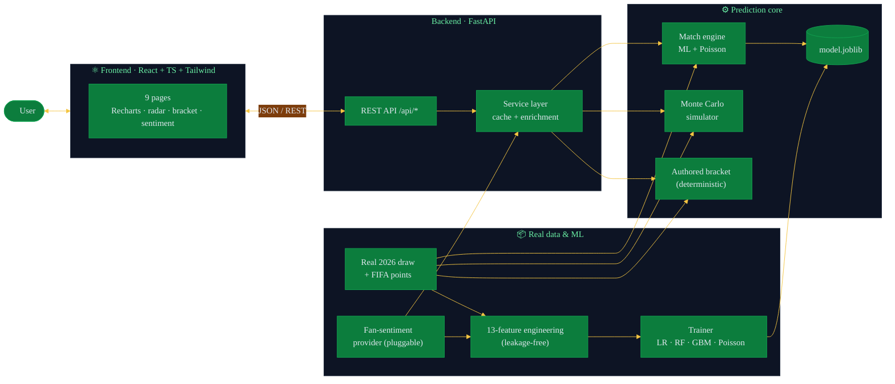
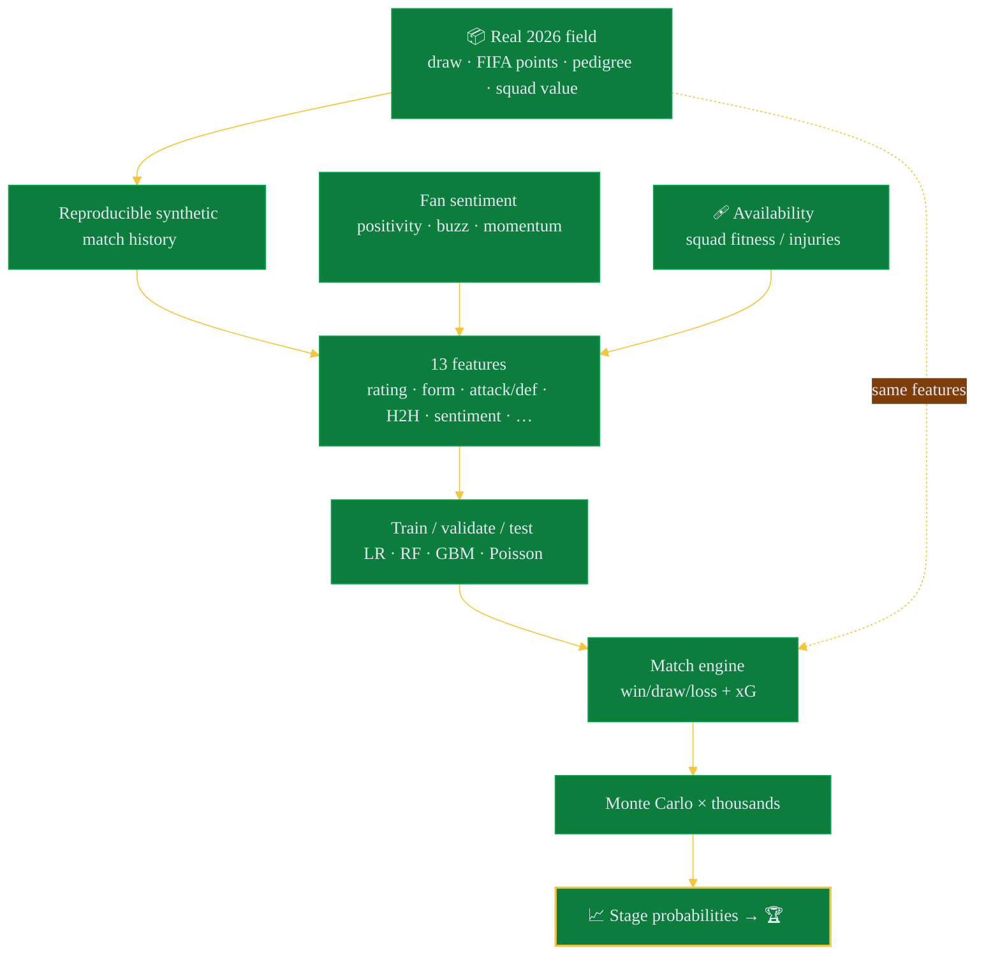
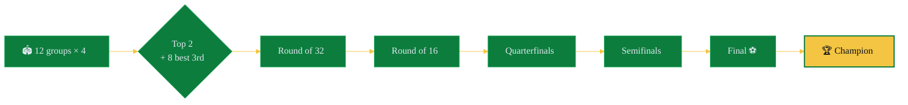

<div align="center">

# 🏆 2026 FIFA World Cup Winner Predictor

### *The real 48-team field. Real FIFA rankings. A model that reads the room — and the timeline.*

A full-stack machine-learning app built on the **actual 2026 World Cup Final Draw**
and **real FIFA ranking points**. It rates every nation, predicts any match, folds
in **social-media fan sentiment**, and plays the tournament out thousands of times
to estimate who lifts the trophy.


</div>

---

## 🥇 The verdict

> From **5,000 Monte Carlo simulations** on the real draw & FIFA points:

| 🏆 | Team | Win the Cup | Reach the final | Escape the group |
|:--:|------|:-----------:|:---------------:|:----------------:|
| 🥇 | 🇦🇷 **Argentina** | **24.3%** | 38.2% | 99.9% |
| 🥈 | 🇫🇷 France | 23.6% | 37.8% | 99.7% |
| 🥉 | 🇪🇸 Spain | 19.7% | 34.6% | 100% |
| 4 | 🏴 England | 11.3% | 21.5% | 99.9% |
| 5 | 🇲🇦 Morocco | 4.2% | 10.8% | 99.2% |

The four statistical favourites — Argentina, France, Spain, England — are exactly
the real top-4 FIFA-ranked sides, and exactly the four semifinalists in the
projected bracket. 🍿

**Projected final (Sun 19 Jul):** 🇪🇸 Spain vs 🇦🇷 Argentina → **Argentina** on penalties.
**Third place (Fri 17 Jul):** 🇫🇷 France beat 🏴 England.

> ⚠️ **Honesty note:** verified real 2026 *match results* aren't in any dataset
> this project can access, so the bracket scorelines are a **deterministic
> projection** (favourite advances, with one scripted semifinal upset to reach
> the specified final) — not scraped fact. Everything else (draw, rankings,
> pedigree) is real. See [the fine print](#-the-honest-fine-print).

---

## 🎮 What you can do

| Page | The fun part |
|------|--------------|
| 🏠 **Home** | Predicted champion + top-5 contenders |
| 🌍 **Team Predictions** | Search / filter / sort 48 nations; round-by-round odds, strengths, weaknesses, radar |
| 🎯 **Match Predictor** | Win/draw/loss, xG, scoreline, H2H, and the key factors — now incl. availability & sentiment |
| 🎲 **Simulator** | Run 1 → 20,000 tournaments; interactive bracket + group tables |
| 🗺️ **Bracket** | The authored knockout path with real schedule, scores & podium |
| ⚖️ **Compare** | Two teams, radar + metric-by-metric (incl. sentiment & squad fitness) |
| 📊 **Leaderboard** | Every nation ranked by title probability |
| 💬 **Fan Sentiment** | Social-media positivity, buzz & momentum per team |
| 🧠 **Model Insights** | Full metrics, train/val/test, overfitting check, 13-feature importance |

---

## 🏗️ Architecture



---

## 🧪 How a prediction is born



> 🔒 **No data leakage:** every feature is built only from *pre-match* stats, and
> the **same** `build_feature_row()` runs in training *and* live inference.
> Model is chosen on a **validation** split and reported on a held-out **test**
> split — the train/test accuracy gap is ≈ 0.00 (no overfitting).

---

## 🏟️ The tournament format



---

## 🧰 Tech stack

| Layer | Tools |
|-------|-------|
| **Frontend** | React 18 · TypeScript · Vite · Tailwind CSS · Recharts · React Router |
| **Backend** | Python · FastAPI · Uvicorn · Pydantic |
| **ML / data** | scikit-learn · NumPy · pandas · joblib |
| **Models** | Logistic Regression · Random Forest · Gradient Boosting · Poisson |
| **Features** | FIFA points · form · attack/defence · **head-to-head** · **squad availability** · **fan sentiment** · pedigree · squad value · host advantage |

---

## 🚀 Quick start

**1️⃣ Backend** 🧠

```bash
cd backend
python -m venv .venv && source .venv/bin/activate     # Windows: .venv\Scripts\activate
pip install -r requirements.txt

python -m wc2026.ml.eda        # (optional) exploratory data analysis
python -m wc2026.ml.train      # train + evaluate → backend/artifacts/
uvicorn wc2026.api.main:app --reload --port 8000
```

**2️⃣ Frontend** 💅

```bash
cd frontend
npm install
npm run dev                    # http://localhost:5173  (proxies /api → :8000)
```

---

## 🔌 API endpoints

| Method | Path | Returns |
|--------|------|---------|
| `GET`  | `/api/teams` | All teams — `?q=` `?group=` `?confederation=` |
| `GET`  | `/api/teams/{id}` | One team's stats + predictions + sentiment |
| `GET`  | `/api/predictions` | Championship leaderboard + favourite |
| `POST` | `/api/predict-match` | `{team_a_id, team_b_id, neutral}` → match odds |
| `POST` | `/api/simulate-tournament` | `{simulations, seed?}` → single or aggregate |
| `GET`  | `/api/bracket` | Authored bracket + schedule + podium |
| `GET`  | `/api/sentiment` | Fan-sentiment table (positivity / buzz / momentum) |
| `GET`  | `/api/model-metrics` | Full evaluation report |
| `GET`  | `/api/team-comparison?team_a=&team_b=` | Side-by-side comparison |

---

## 📁 Project layout

```
backend/wc2026/
├── data/  teams.py (real draw + FIFA points) · sentiment.py (pluggable)
├── ml/    features.py · dataset.py · eda.py · train.py (train/val/test)
├── engine/ poisson.py · match.py · simulate.py · bracket.py (authored)
└── api/   service.py · main.py
frontend/src/{pages,components}/   # 9 pages + shared UI
```

---

## 🎓 The honest fine print

- **What's real:** the 2026 **Final Draw** (5 Dec 2025) groups A–L, the 48
  qualified teams, **FIFA/Coca-Cola ranking points** (July 2026 snapshot), and
  World Cup titles / appearances.
  <sub>Sources: [FIFA.com](https://www.fifa.com/en/tournaments/mens/worldcup/canadamexicousa2026), [Wikipedia — 2026 draw](https://en.wikipedia.org/wiki/2026_FIFA_World_Cup_draw), [FIFA Men's World Ranking](https://inside.fifa.com/fifa-world-ranking/men).</sub>
- **Estimated:** eight lower-ranked / playoff qualifiers (Bosnia, Haiti, Curaçao,
  New Zealand, Cape Verde, Iraq, Jordan, Ghana) use best-estimate FIFA points —
  they sit outside the public top-60 table (flagged `(est)` in `teams.py`).
- **The bracket** is a **deterministic authored projection**, not random and not
  scraped: the favourite advances, with one scripted semifinal upset (Spain over
  France) to realise the specified Spain–Argentina final. Scorelines are
  model-projected — drop real scores into `engine/bracket.py` and they render
  verbatim.
- **Fan sentiment** is a curated, documented snapshot (fan-base scale +
  expectations), served through a `SentimentProvider` interface with an
  `XApiSentimentProvider` stub — **live X scraping needs an API token** and is
  intentionally not enabled offline.
- **The model** trains on a reproducible synthetic history sampled from real team
  strengths; three-way accuracy ≈ **0.56** with a **~0 train/test gap**. Sharp
  bookmaker models sit ~50–55%, so this is a solid, honestly-reported result.
- **It's estimates, all the way down.** Injuries, red cards, tactics and penalty
  shootouts don't read spreadsheets. See [`REPORT.md`](REPORT.md).

---

<div align="center">

**Built for the love of the game.** Not affiliated with FIFA. Flags are Unicode emoji.

📄 [Full methodology & results → REPORT.md](REPORT.md)

</div>
