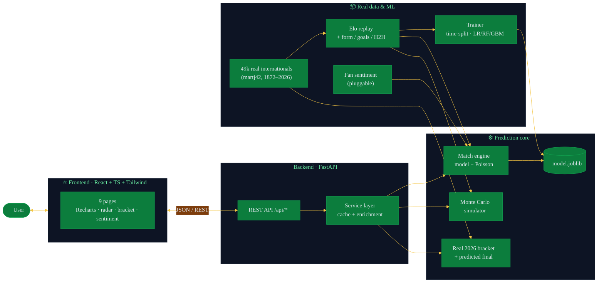
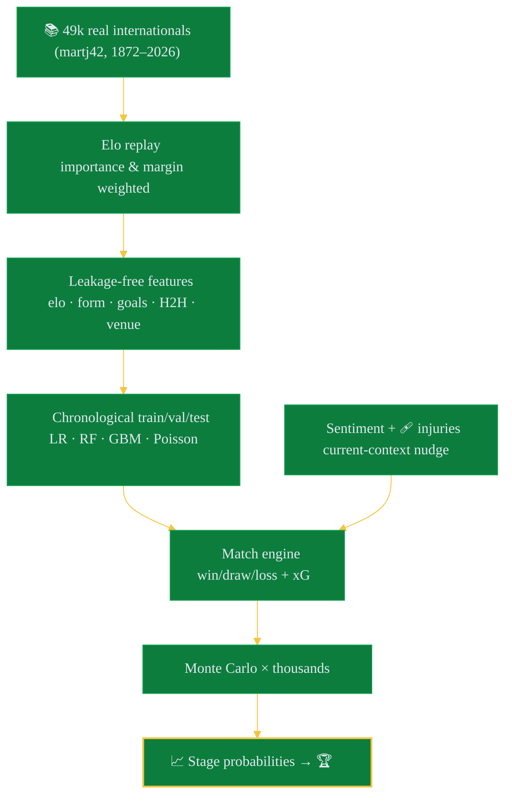

<div align="center">

# 🏆 2026 FIFA World Cup Winner Predictor

### *Trained on 49,000+ real international matches. Built on the real 2026 results.*

A full-stack ML app that replays **every international since 1872** into a live Elo,
trains an outcome model on real history, folds in **fan sentiment** and injuries,
and reports each nation's odds — with a bracket built from the **actual recorded
2026 World Cup results** through the semifinals.

### ▶️ [**Live demo →** shreyas463.github.io/2026-fifa-world-cup-final-predictor](https://shreyas463.github.io/2026-fifa-world-cup-final-predictor/)


</div>

---

## 🥇 The verdict

> From **5,000 Monte Carlo simulations** on real, Elo-replayed team strengths:

| 🏆 | Team | Win the Cup | Reach the final | Escape the group |
|:--:|------|:-----------:|:---------------:|:----------------:|
| 🥇 | 🇪🇸 **Spain** | **40.9%** | 53.7% | 99.9% |
| 🥈 | 🇦🇷 Argentina | 20.2% | 35.2% | 99.7% |
| 🥉 | 🇫🇷 France | 9.7% | 19.2% | 99.3% |
| 4 | 🇨🇴 Colombia | 5.5% | 12.8% | 95.8% |
| 5 | 🇵🇹 Portugal | 3.6% | 9.5% | 96.1% |

Spain tops the model on the back of the **highest real Elo** in the field — and,
in the real data, they've already beaten France 2-0 in the semifinal.

**🗺️ Bracket (real results):** every match group-stage → semifinals uses the
**actual recorded scoreline**. As of the data snapshot the **final (Sun 19 Jul,
🇪🇸 Spain vs 🇦🇷 Argentina)** and **third-place play-off (🇫🇷 France vs 🏴 England)**
are unplayed — the model predicts **Spain 1-0 Argentina** and France for third.

---

## 🎮 What you can do

| Page | The fun part |
|------|--------------|
| 🏠 **Home** | Predicted champion + top-5 contenders |
| 🌍 **Team Predictions** | Search / filter / sort 48 nations; round-by-round odds, radar, strengths |
| 🎯 **Match Predictor** | Win/draw/loss, xG, scoreline, **real head-to-head history**, key factors |
| 🎲 **Simulator** | Run 1 → 20,000 tournaments; interactive bracket + group tables |
| 🗺️ **Bracket** | Real recorded 2026 results + predicted final/third-place |
| ⚖️ **Compare** | Two teams, radar + metric-by-metric (Elo, availability, sentiment) |
| 📊 **Leaderboard** | Every nation ranked by title probability |
| 💬 **Fan Sentiment** | Social-media positivity, buzz & momentum per team |
| 🧠 **Model Insights** | Real-data metrics, chronological split, overfitting check, feature importance |

---

## 🏗️ Architecture



---

## 🧪 How a prediction is born



> 🔒 **No leakage, honest testing:** every feature uses only pre-match state, and
> the model is trained on the past and tested on the **most recent** matches
> (chronological split). Train/test accuracy gap ≈ 0 — no overfitting.

---

## 🧰 Tech stack

| Layer | Tools |
|-------|-------|
| **Frontend** | React 18 · TypeScript · Vite · Tailwind CSS · Recharts · React Router |
| **Backend** | Python · FastAPI · Uvicorn · Pydantic |
| **ML / data** | scikit-learn · NumPy · pandas · joblib |
| **Data** | [martj42/international_results](https://github.com/martj42/international_results) (49k+ matches) |
| **Features** | real Elo · form · goals for/against · head-to-head · home advantage · + sentiment/injury nudges |

---

## 🚀 Quick start

**1️⃣ Backend** 🧠

```bash
cd backend
python -m venv .venv && source .venv/bin/activate     # Windows: .venv\Scripts\activate
pip install -r requirements.txt

# Optional — only needed to RE-train (cached artifacts are committed):
git clone https://github.com/martj42/international_results.git data_raw
python -m wc2026.ml.eda        # exploratory data analysis on real matches
python -m wc2026.ml.train      # Elo replay + train → backend/artifacts/

uvicorn wc2026.api.main:app --reload --port 8000
```

The app ships with cached `model.joblib`, `current_form.json` and
`bracket_2026.json`, so it runs **without** the raw dataset. Re-training just
refreshes them.

**2️⃣ Frontend** 💅

```bash
cd frontend
npm install
npm run dev                    # http://localhost:5173  (proxies /api → :8000)
```

### 🚀 Deploy (static, no server)

The whole app can run as a **static site** — the backend pre-computes every
response to JSON and the frontend serves it (match predictor & simulator
included). It's deployed to GitHub Pages:

```bash
./deploy.sh    # exports data → builds with VITE_STATIC → pushes to gh-pages
```

Under the hood: `python -m scripts.export_static` writes `frontend/public/data/*.json`,
then `VITE_STATIC=true npm run build` produces a self-contained site. Any static
host works; point `VITE_API_URL` at a running backend instead to use the live API.

---

## 🔌 API endpoints

| Method | Path | Returns |
|--------|------|---------|
| `GET`  | `/api/teams` | All teams — `?q=` `?group=` `?confederation=` |
| `GET`  | `/api/teams/{id}` | One team's stats + predictions + sentiment |
| `GET`  | `/api/predictions` | Championship leaderboard + favourite |
| `POST` | `/api/predict-match` | `{team_a_id, team_b_id, neutral}` → odds + real H2H |
| `POST` | `/api/simulate-tournament` | `{simulations, seed?}` → single or aggregate |
| `GET`  | `/api/bracket` | Real 2026 bracket + predicted final/third-place |
| `GET`  | `/api/sentiment` | Fan-sentiment table |
| `GET`  | `/api/model-metrics` | Full evaluation report |
| `GET`  | `/api/team-comparison?team_a=&team_b=` | Side-by-side comparison |

---

## 📁 Project layout

```
backend/wc2026/
├── data/    teams.py · sentiment.py · wc2026.py (real bracket)
├── ml/      history.py · elo_features.py · eda.py · train.py
├── engine/  poisson.py · match.py · simulate.py · bracket.py (fallback)
└── api/     service.py · main.py
frontend/src/{pages,components}/   # 9 pages + shared UI
```

---

## 🎓 The honest fine print

- **Trained on real matches.** ~49,000 internationals (1872–2026) from
  [martj42/international_results](https://github.com/martj42/international_results),
  replayed into a World-Football-style **Elo**; the classifier learns from real
  Elo, form, goal rates, head-to-head and home advantage. **Test accuracy ≈ 0.61**
  on the most recent matches (chronological split, no overfitting). Injuries and
  fan sentiment — absent from match history — are applied as small documented
  **current-context nudges**.
- **The bracket is real** through the semifinals — actual recorded scorelines
  (penalty shootouts resolved from the dataset). The **final and third-place**
  are genuinely unplayed as of the snapshot, so those two are clearly-flagged
  **model predictions**.
- **The 2026 field & draw are real** (Final Draw, 5 Dec 2025). FIFA ranking
  points are real (July 2026); eight lower-ranked qualifiers use best-estimate
  points (flagged in `teams.py`).
- **Fan sentiment** is a curated, documented snapshot behind a `SentimentProvider`
  interface with an `XApiSentimentProvider` stub — live X scraping needs an API
  token and isn't enabled offline.
- **It's estimates, all the way down.** Injuries, red cards, tactics and penalty
  shootouts don't read spreadsheets. See [`REPORT.md`](REPORT.md).

---

<div align="center">

**Built for the love of the game.** Not affiliated with FIFA. Flags are Unicode emoji.
Match data © [martj42/international_results](https://github.com/martj42/international_results) (CC0).

📄 [Full methodology & results → REPORT.md](REPORT.md)

</div>
