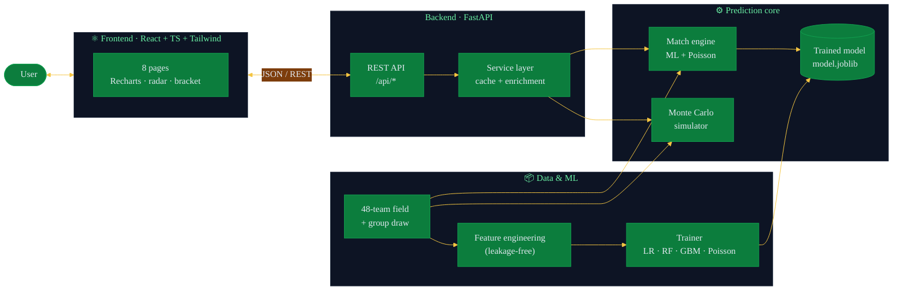
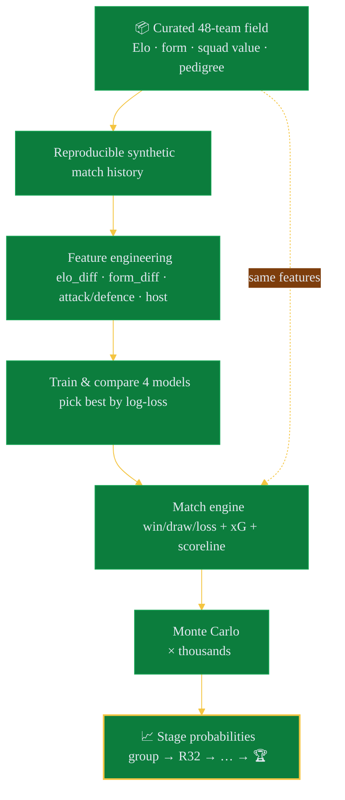
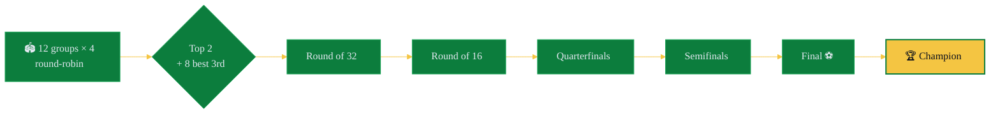

<div align="center">

# 🏆 2026 FIFA World Cup Winner Predictor

### *48 teams. 104 matches. Thousands of simulated timelines. One data-driven favourite.*

A full-stack machine-learning app that rates every nation, predicts any match, and
plays out the entire 2026 World Cup **thousands of times** to answer the only
question that matters: **who lifts the trophy?**


</div>

---

## 🥇 The verdict

> Straight from **5,000 Monte Carlo simulations** of the full tournament:

| 🏆 | Team | Win the Cup | Reach the final | Escape the group |
|:--:|------|:-----------:|:---------------:|:----------------:|
| 🥇 | 🇦🇷 **Argentina** | **22.2%** | 35.0% | 99.6% |
| 🥈 | 🇫🇷 France | 20.1% | 33.1% | 99.4% |
| 🥉 | 🇪🇸 Spain | 18.1% | 30.2% | 99.2% |
| 4 | 🇧🇷 Brazil | 9.4% | 18.4% | 98.0% |
| 5 | 🏴 England | 6.7% | 15.0% | 97.2% |

The top three are separated by a whisker — together they win ~60% of simulated
tournaments. This is a **race, not a coronation.** 🍿

> ⚠️ **Reality check:** every number here is a probability-based estimate, not a
> prophecy. Injuries, red cards, tactics, penalty shootouts and plain old chaos
> don't read spreadsheets.

---

## 🎮 What you can actually do

| Page | The fun part |
|------|--------------|
| 🏠 **Home** | Meet the predicted champion and the top-5 contenders |
| 🌍 **Team Predictions** | Search, filter & sort all 48 nations; round-by-round odds, strengths, weaknesses & a radar profile per team |
| 🎯 **Match Predictor** | Pit **any two** teams: win/draw/loss odds, expected goals, scoreline, head-to-head & the *why* behind the call |
| 🎲 **Simulator** | Run **1 → 20,000** tournaments and watch an interactive bracket unfold |
| 🗺️ **Bracket** | The most-likely path from group stage to glory — click any tie for details |
| ⚖️ **Compare** | Two teams, side-by-side, radar chart + metric-by-metric showdown |
| 📊 **Leaderboard** | Every nation ranked by title probability |
| 🧠 **Model Insights** | Accuracy, log-loss, ROC-AUC, Brier, confusion matrix, feature importance & calibration — no black boxes |

---

## 🏗️ Architecture



---

## 🧪 How a prediction is born



> 🔒 **No data leakage, by construction.** Every feature is built only from
> *pre-match* stats, and the **same** `build_feature_row()` runs in training
> *and* live inference — the model can never peek at the future or see
> mismatched inputs.

---

## 🏟️ The tournament, the way FIFA drew it up



Every simulation plays this out end-to-end — group results, tiebreakers,
knockout ties, and penalty shootouts when 90 minutes isn't enough. 🥅

---

## 🧰 Tech stack

| Layer | Tools |
|-------|-------|
| **Frontend** | React 18 · TypeScript · Vite · Tailwind CSS · Recharts · React Router |
| **Backend** | Python · FastAPI · Uvicorn · Pydantic |
| **ML / data** | scikit-learn · NumPy · pandas · joblib |
| **Models** | Logistic Regression · Random Forest · Gradient Boosting · Poisson goal model |

---

## 🚀 Quick start

**1️⃣ Backend** — the brains 🧠

```bash
cd backend
python -m venv .venv && source .venv/bin/activate     # Windows: .venv\Scripts\activate
pip install -r requirements.txt

python -m wc2026.ml.eda        # (optional) exploratory data analysis
python -m wc2026.ml.train      # train + evaluate → backend/artifacts/
uvicorn wc2026.api.main:app --reload --port 8000
```

→ API live at **http://localhost:8000** · interactive docs at **`/docs`** 📜

**2️⃣ Frontend** — the pretty face 💅

```bash
cd frontend
npm install
npm run dev                    # http://localhost:5173  (proxies /api → :8000)
```

→ Open **http://localhost:5173** and start predicting. Point at a remote API by
setting `VITE_API_URL` (see `.env.example`).

---

## 🔌 API endpoints

| Method | Path | Returns |
|--------|------|---------|
| `GET`  | `/api/teams` | All teams — supports `?q=` `?group=` `?confederation=` |
| `GET`  | `/api/teams/{id}` | One team's full stats + predictions |
| `GET`  | `/api/predictions` | Championship leaderboard + favourite |
| `POST` | `/api/predict-match` | `{team_a_id, team_b_id, neutral}` → match odds |
| `POST` | `/api/simulate-tournament` | `{simulations, seed?}` → single bracket **or** aggregate odds |
| `GET`  | `/api/bracket` | Most-likely predicted bracket |
| `GET`  | `/api/model-metrics` | Full model evaluation report |
| `GET`  | `/api/team-comparison?team_a=&team_b=` | Side-by-side comparison |
| `GET`  | `/api/health` | Service + model status |

---

## 📁 Project layout

```
2026-fifa-world-cup-final-predictor/
├── backend/                      # 🐍 Python · FastAPI · scikit-learn
│   └── wc2026/
│       ├── data/teams.py         # 48-team field + deterministic group draw
│       ├── ml/                   # features · dataset · eda · train
│       ├── engine/               # poisson · match · simulate (Monte Carlo)
│       └── api/                  # service (cache) · main (REST)
├── frontend/                     # ⚛️ React · TypeScript · Tailwind · Recharts
│   └── src/{pages,components}/    # 8 pages + shared UI
├── REPORT.md                     # 📄 methodology · results · limitations
└── README.md                     # 👋 you are here
```

---

## 🎓 The honest fine print

- **Data source.** Live match-feed scraping is intentionally skipped so the whole
  project is **reproducible and runs offline.** The training history is *sampled
  from latent team strengths* rather than scraped — swap in a real results feed
  and only [`ml/dataset.py`](backend/wc2026/ml/dataset.py) changes.
- **Accuracy in context.** Predicting a **three-way** result *with draws* is hard;
  sharp bookmaker models sit around 50–55%. Well-ranked, reasonably-calibrated
  odds (ROC-AUC ≈ 0.63) is a solid outcome — see [`REPORT.md`](REPORT.md).
- **The 2026 field is a projection** — qualification, groups and squads will shift
  before a ball is kicked.
- **It's estimates, all the way down.** Football's magic is that the model can be
  right on average and gloriously wrong on the day. That's the whole point. ⚽

---

<div align="center">

**Built for the love of the game.** Not affiliated with FIFA. Flags are Unicode emoji.

📄 [Full methodology & results → REPORT.md](REPORT.md)

</div>
